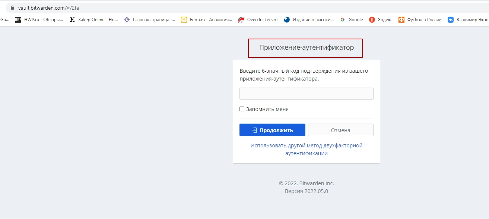
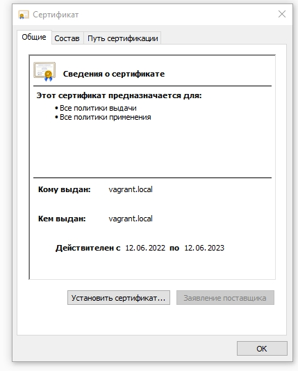
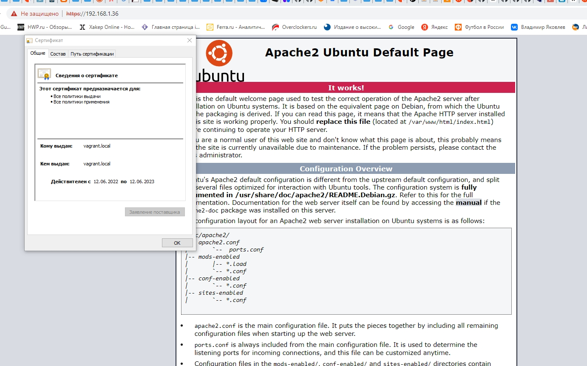
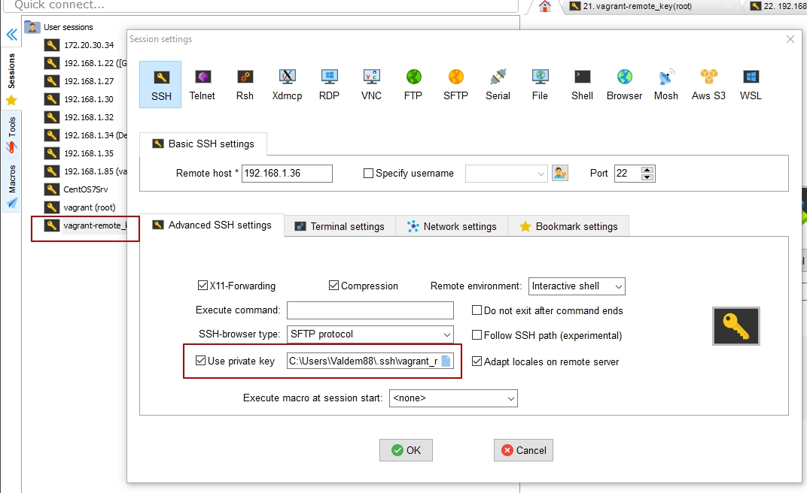
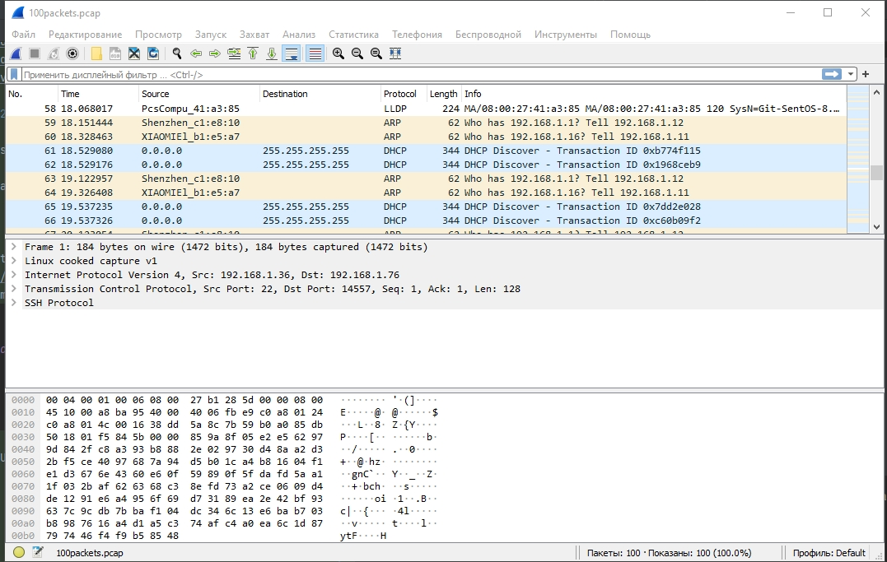

# Домашнее задание к занятию "3.9. Элементы безопасности информационных систем" - yakovlev_vs

#### 1. Установите Bitwarden плагин для браузера. Зарегестрируйтесь и сохраните несколько паролей.

Решение

Bitwarden плагин установлен


#### 2. Установите Google authenticator на мобильный телефон. Настройте вход в Bitwarden акаунт через Google authenticator OTP.

Решение




#### 3. Установите apache2, сгенерируйте самоподписанный сертификат, настройте тестовый сайт для работы по HTTPS.

Решение
- Установка apache2
```bash
root@vagrant:~# apt install apache2
```
- Создание самоподписанного сертификата
```bash
root@vagrant:~# openssl req -x509 -nodes -days 365 -newkey rsa:2048 -keyout /etc/ssl/private/apache-ssl.key -out /etc/ssl/certs/apache-ssl.crt                Generating a RSA private key
..........................+++++
........................+++++
writing new private key to '/etc/ssl/private/apache-ssl.key'
-----
You are about to be asked to enter information that will be incorporated
into your certificate request.
What you are about to enter is what is called a Distinguished Name or a DN.
There are quite a few fields but you can leave some blank
For some fields there will be a default value,
If you enter '.', the field will be left blank.
-----
.......
```
- настройка файлов конфигурации
```bash
 root@vagrant:~# nano /etc/apache2/conf-available/ssl-params.conf

SSLCipherSuite EECDH+AESGCM:EDH+AESGCM:AES256+EECDH:AES256+EDH
SSLProtocol All -SSLv2 -SSLv3 -TLSv1 -TLSv1.1
SSLHonorCipherOrder On
# Disable preloading HSTS for now.  You can use the commented out header line that includes
# the "preload" directive if you understand the implications.
# Header always set Strict-Transport-Security "max-age=63072000; includeSubDomains; preload"
Header always set X-Frame-Options DENY
Header always set X-Content-Type-Options nosniff
# Requires Apache >= 2.4.41
SSLCompression off
SSLUseStapling on
SSLStaplingCache "shmcb:logs/stapling-cache(150000)"
# Requires Apache >= 2.4.41
SSLSessionTickets Off
```
```bash
root@vagrant:~# nano /etc/apache2/sites-available/default-ssl.conf

<IfModule mod_ssl.c>
	<VirtualHost _default_:443>
		ServerAdmin webmaster@localhost

		DocumentRoot /var/www/html

		ErrorLog ${APACHE_LOG_DIR}/error.log
		CustomLog ${APACHE_LOG_DIR}/access.log combined
		
		SSLEngine on
		
		SSLCertificateFile	/etc/ssl/certs/apache-ssl.crt
		SSLCertificateKeyFile /etc/ssl/private/apache-ssl.key

		
		#SSLOptions +FakeBasicAuth +ExportCertData +StrictRequire
		<FilesMatch "\.(cgi|shtml|phtml|php)$">
				SSLOptions +StdEnvVars
		</FilesMatch>
		<Directory /usr/lib/cgi-bin>
				SSLOptions +StdEnvVars
		</Directory>

		
	</VirtualHost>
</IfModule>

```
```bash
root@vagrant:~# nano /etc/apache2/sites-available/000-default.conf

<VirtualHost *:80>
	
	ServerAdmin webmaster@localhost
	DocumentRoot /var/www/html
  Redirect "/" "https://192.168.1.36/"

	ErrorLog ${APACHE_LOG_DIR}/error.log
	CustomLog ${APACHE_LOG_DIR}/access.log combined

</VirtualHost>

# vim: syntax=apache ts=4 sw=4 sts=4 sr noet
```
- подключение модулей
```bash
root@vagrant:~# a2enmod ssl
Considering dependency setenvif for ssl:
Module setenvif already enabled
Considering dependency mime for ssl:
Module mime already enabled
Considering dependency socache_shmcb for ssl:
Enabling module socache_shmcb.
Enabling module ssl.
See /usr/share/doc/apache2/README.Debian.gz on how to configure SSL and create self-signed certificates.
To activate the new configuration, you need to run:
  systemctl restart apache2

root@vagrant:~# systemctl restart apache2

root@vagrant:~# a2enmod headers
Module headers already enabled

root@vagrant:~# a2ensite default-ssl
Site default-ssl already enabled

root@vagrant:~# a2enconf ssl-params
Enabling conf ssl-params.
To activate the new configuration, you need to run:
  systemctl reload apache2

root@vagrant:~# systemctl reload apache2

root@vagrant:~# apache2ctl configtest
AH00558: apache2: Could not reliably determine the server's fully qualified domain name, using 127.0.1.1. Set the 'ServerName' directive globally to suppress this message
Syntax OK

root@vagrant:~# systemctl restart apache2
```




#### 4. Проверьте на TLS уязвимости произвольный сайт в интернете (кроме сайтов МВД, ФСБ, МинОбр, НацБанк, РосКосмос, РосАтом, РосНАНО и любых госкомпаний, объектов КИИ, ВПК ... и тому подобное).

Решение

```bash
root@vagrant:~# wget  https://testssl.sh/testssl.sh
root@vagrant:~# chmod u+rwx testssl.sh
root@vagrant:~# ls -l
total 996
-rwxr-xr-x 2 vagrant vagrant       0 May 28 11:05 hardlink_fle
-rwxr-xr-x 2 vagrant vagrant       0 May 28 11:05 link
-rw-r--r-- 1 root    root        182 May 29 15:18 part_table
drwxr-xr-x 3 root    root       4096 Dec 19 19:42 snap
-rwxr--r-- 1 root    root    1008887 Oct  3  2021 testssl.sh
```
```bash
root@vagrant:~# ./testssl.sh -U --sneaky suip.biz

ATTENTION: No cipher mapping file found!
Please note from 2.9 on testssl.sh needs files in "$TESTSSL_INSTALL_DIR/etc/" to function correctly.

Type "yes" to ignore this warning and proceed at your own risk --> yes

ATTENTION: No TLS data file found -- needed for socket-based handshakes
Please note from 2.9 on testssl.sh needs files in "$TESTSSL_INSTALL_DIR/etc/" to function correctly.

Type "yes" to ignore this warning and proceed at your own risk --> yes

No engine or GOST support via engine with your /usr/bin/openssl

###########################################################
    testssl.sh       3.0.6 from https://testssl.sh/

      This program is free software. Distribution and
             modification under GPLv2 permitted.
      USAGE w/o ANY WARRANTY. USE IT AT YOUR OWN RISK!

       Please file bugs @ https://testssl.sh/bugs/

###########################################################

 Using "OpenSSL 1.1.1f  31 Mar 2020" [~0 ciphers]
 on vagrant:/usr/bin/openssl
 (built: "Nov 24 13:20:48 2021", platform: "debian-amd64")


 Start 2022-06-12 22:22:29        -->> 185.117.153.79:443 (suip.biz) <<--

 Further IP addresses:   2a02:f680:1:1100::3d60
 rDNS (185.117.153.79):  suip.biz.
 Testing with suip.biz:443 only worked using /usr/bin/openssl.
 Test results may be somewhat better if the --ssl-native option is used.
 Type "yes" to proceed and accept false negatives or positives --> yes
 Service detected:       HTTP


 Testing vulnerabilities

 Heartbleed (CVE-2014-0160)                Error setting TLSv1.3 ciphersuites
140144049354048:error:1426E0B9:SSL routines:ciphersuite_cb:no cipher match:../ssl/ssl_ciph.c:1294:
not vulnerable (OK), no heartbeat extension
 CCS (CVE-2014-0224)                       not vulnerable (OK)
 Ticketbleed (CVE-2016-9244), experiment.  not vulnerable (OK)
 ROBOT                                     Server does not support any cipher suites that use RSA key transport
 Secure Renegotiation (RFC 5746)           supported (OK)
 Secure Client-Initiated Renegotiation     not vulnerable (OK)
 CRIME, TLS (CVE-2012-4929)                test failed (couldn't connect)
 BREACH (CVE-2013-3587)                    no HTTP compression (OK)  - only supplied "/" tested
 POODLE, SSL (CVE-2014-3566)               not vulnerable (OK), no SSLv3 support
 TLS_FALLBACK_SCSV (RFC 7507)              test failed (couldn't connect)
 SWEET32 (CVE-2016-2183, CVE-2016-6329)    not vulnerable (OK)
 FREAK (CVE-2015-0204)                     not vulnerable (OK)
 DROWN (CVE-2016-0800, CVE-2016-0703)      not vulnerable on this host and port (OK)
                                           make sure you don't use this certificate elsewhere with SSLv2 enabled services
                                           https://censys.io/ipv4?q=1868E693380F83292CE3E6F2D63FD655400698F2EA834DA143D11D0C6F85E234 could help you to find out
 LOGJAM (CVE-2015-4000), experimental      not vulnerable (OK): no DH EXPORT ciphers, no DH key detected with <= TLS 1.2
 BEAST (CVE-2011-3389)                     not vulnerable (OK), no SSL3 or TLS1
 LUCKY13 (CVE-2013-0169), experimental     Error setting TLSv1.3 ciphersuites
139923737863488:error:1426E0B9:SSL routines:ciphersuite_cb:no cipher match:../ssl/ssl_ciph.c:1294:
potentially VULNERABLE, uses cipher block chaining (CBC) ciphers with TLS. Check patches
 RC4 (CVE-2013-2566, CVE-2015-2808)        Local problem: No RC4 Ciphers configured in /usr/bin/openssl


 Done 2022-06-12 22:24:38 [ 137s] -->> 185.117.153.79:443 (suip.biz) <<--
```
#### 5. Установите на Ubuntu ssh сервер, сгенерируйте новый приватный ключ. Скопируйте свой публичный ключ на другой сервер. Подключитесь к серверу по SSH-ключу.

Решение

```bash
[root@Git-SentOS-8 ~]# ssh-keygen
Generating public/private rsa key pair.
Enter file in which to save the key (/root/.ssh/id_rsa): /root/.ssh/vagrant_rsa
Enter passphrase (empty for no passphrase):
Enter same passphrase again:
Your identification has been saved in /root/.ssh/vagrant_rsa.
Your public key has been saved in /root/.ssh/vagrant_rsa.pub.
The key fingerprint is:
SHA256:1JdX........mUerKVgDQ3.......pVz5Pb0U... root@Git-SentOS-8.local
The key's randomart image is:
+---[RSA 3072]----+
|        .+=*+%**+|
|         o+=EoO==|
|        . o =Bo.B|
|       .   +o==o+|
|        S   =o.oo|
|           .  o. |
|               . |
|                 |
|                 |
+----[SHA256]-----+
```
pytty
```bash
login as: root
Authenticating with public key "root@Git-SentOS-8.local"
Passphrase for key "root@Git-SentOS-8.local":
Welcome to Ubuntu 20.04.3 LTS (GNU/Linux 5.4.0-91-generic x86_64)

 * Documentation:  https://help.ubuntu.com
 * Management:     https://landscape.canonical.com
 * Support:        https://ubuntu.com/advantage

  System information as of Mon 13 Jun 2022 02:15:46 PM MSK

  System load:  0.0                Processes:             132
  Usage of /:   13.2% of 30.88GB   Users logged in:       1
  Memory usage: 21%                IPv4 address for eth0: 192.168.1.36
  Swap usage:   0%


This system is built by the Bento project by Chef Software
More information can be found at https://github.com/chef/bento
Last login: Mon Jun 13 14:05:15 2022 from 192.168.1.22
root@vagrant:~#
```




.jpg)

#### 6. Переименуйте файлы ключей из задания 5. Настройте файл конфигурации SSH клиента, так чтобы вход на удаленный сервер осуществлялся по имени сервера.

Решение

```bash
[root@Git-SentOS-8 .ssh]# mv ~/.ssh/vagrant_rsa ~/.ssh/vagrant_rsa_netology
[root@Git-SentOS-8 .ssh]# nano ~/.ssh/config
....
Host vagrant-remote_key
        HostName 192.168.1.36
        User root
        Port 22
        IdentityFile ~/.ssh/vagrant_rsa_netology
....
[root@Git-SentOS-8 .ssh]# ssh vagrant-remote_key
Enter passphrase for key '/root/.ssh/vagrant_rsa_netology':
Welcome to Ubuntu 20.04.3 LTS (GNU/Linux 5.4.0-91-generic x86_64)

 * Documentation:  https://help.ubuntu.com
 * Management:     https://landscape.canonical.com
 * Support:        https://ubuntu.com/advantage

  System information as of Mon 13 Jun 2022 02:38:41 PM MSK

  System load:  0.0                Processes:             134
  Usage of /:   13.2% of 30.88GB   Users logged in:       1
  Memory usage: 21%                IPv4 address for eth0: 192.168.1.36
  Swap usage:   0%


This system is built by the Bento project by Chef Software
More information can be found at https://github.com/chef/bento
Last login: Mon Jun 13 14:24:08 2022 from 192.168.1.76
```

#### 7. Соберите дамп трафика утилитой tcpdump в формате pcap, 100 пакетов. Откройте файл pcap в Wireshark.

Решение 

```bash
root@vagrant:~# tcpdump -nnei any -c 100 -w 100packets.pcap
tcpdump: listening on any, link-type LINUX_SLL (Linux cooked v1), capture size 262144 bytes
100 packets captured
101 packets received by filter
0 packets dropped by kernel
root@vagrant:~# ls -l
total 1024
-rw-r--r-- 1 tcpdump tcpdump   26712 Jun 13 14:43 100packets.pcap
-rwxr-xr-x 2 vagrant vagrant       0 May 28 14:05 hardlink_fle
-rwxr-xr-x 2 vagrant vagrant       0 May 28 14:05 link
-rw-r--r-- 1 root    root        182 May 29 18:18 part_table
drwxr-xr-x 3 root    root       4096 Dec 19 22:42 snap
-rwxr--r-- 1 root    root    1008887 Oct  3  2021 testssl.sh
```


#### 8*. Просканируйте хост scanme.nmap.org. Какие сервисы запущены?

Решение

```bash
[root@Git-SentOS-8 .ssh]# nmap scanme.nmap.org
bash: nmap: команда не найдена...
Установить пакет «nmap», предоставляющий команду «nmap»? [N/y] y


 * Ожидание в очереди...
 * Загрузка списка пакетов....
Следующие пакеты должны быть установлены:
 nmap-2:7.70-6.el8.x86_64       Network exploration tool and security scanner
Продолжить с этими изменениями? [N/y] y


 * Ожидание в очереди...
 * Ожидание аутентификации...
 * Ожидание в очереди...
 * Загрузка пакетов...
 * Запрос данных...
 * Проверка изменений...
 * Установка пакетов...
Starting Nmap 7.70 ( https://nmap.org ) at 2022-06-13 15:20 MSK
Nmap scan report for scanme.nmap.org (45.33.32.156)
Host is up (0.19s latency).
Other addresses for scanme.nmap.org (not scanned): 2600:3c01::f03c:91ff:fe18:bb2f
Not shown: 996 closed ports
PORT      STATE SERVICE
22/tcp    open  ssh
80/tcp    open  http
9929/tcp  open  nping-echo
31337/tcp open  Elite

Nmap done: 1 IP address (1 host up) scanned in 2.98 seconds

[root@Git-SentOS-8 .ssh]# nmap scanme.nmap.org
Starting Nmap 7.70 ( https://nmap.org ) at 2022-06-13 15:20 MSK
Nmap scan report for scanme.nmap.org (45.33.32.156)
Host is up (0.19s latency).
Other addresses for scanme.nmap.org (not scanned): 2600:3c01::f03c:91ff:fe18:bb2f
Not shown: 995 closed ports
PORT      STATE    SERVICE
22/tcp    open     ssh
80/tcp    open     http
9929/tcp  open     nping-echo
11111/tcp filtered vce
31337/tcp open     Elite

Nmap done: 1 IP address (1 host up) scanned in 2.43 seconds
```
Работают сервисы ssh, web-server, nping-echo server, открыт порт 31337

#### 9*. Установите и настройте фаервол ufw на web-сервер из задания 3. Откройте доступ снаружи только к портам 22,80,443

Решение

```bash
root@vagrant:~# ufw status verbose
Status: active
Logging: on (low)
Default: deny (incoming), allow (outgoing), disabled (routed)
New profiles: skip

To                         Action      From
--                         ------      ----
22/tcp (OpenSSH)           ALLOW IN    Anywhere
22                         ALLOW IN    Anywhere
22/tcp                     ALLOW IN    Anywhere
80                         ALLOW IN    Anywhere
443                        ALLOW IN    Anywhere
22/tcp (OpenSSH (v6))      ALLOW IN    Anywhere (v6)
22 (v6)                    ALLOW IN    Anywhere (v6)
22/tcp (v6)                ALLOW IN    Anywhere (v6)
80 (v6)                    ALLOW IN    Anywhere (v6)
443 (v6)                   ALLOW IN    Anywhere (v6)
```

```bash
[root@Git-SentOS-8 .ssh]# nmap 192.168.1.36
Starting Nmap 7.70 ( https://nmap.org ) at 2022-06-13 15:35 MSK
Nmap scan report for 192.168.1.36
Host is up (-0.040s latency).
Not shown: 997 filtered ports
PORT    STATE SERVICE
22/tcp  open  ssh
80/tcp  open  http
443/tcp open  https
MAC Address: 08:00:27:B1:28:5D (Oracle VirtualBox virtual NIC)

Nmap done: 1 IP address (1 host up) scanned in 13.24 seconds
```

